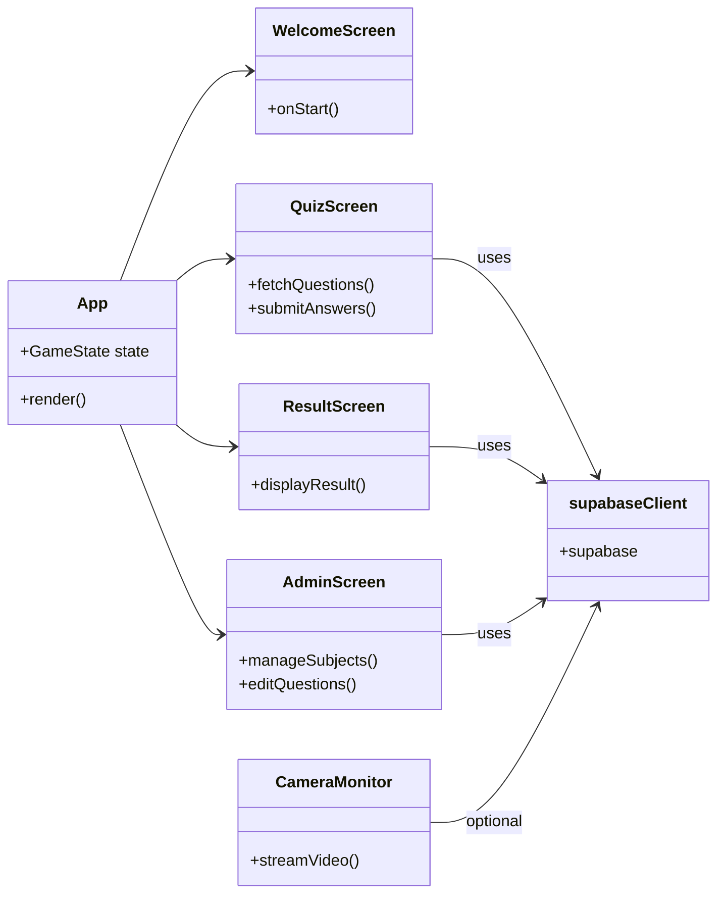
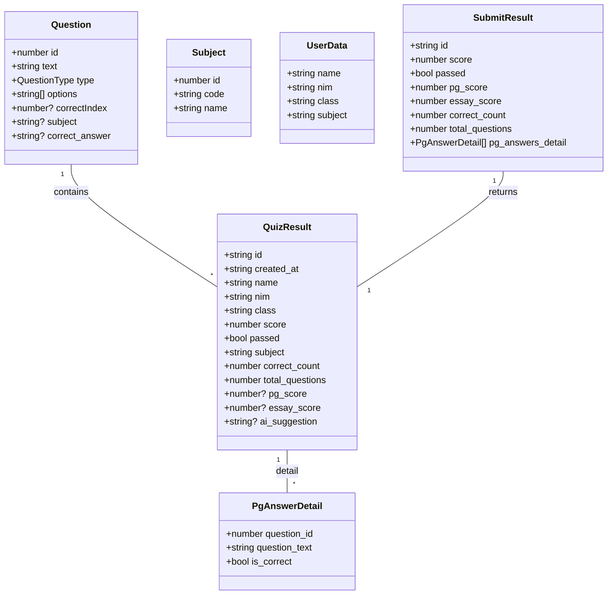
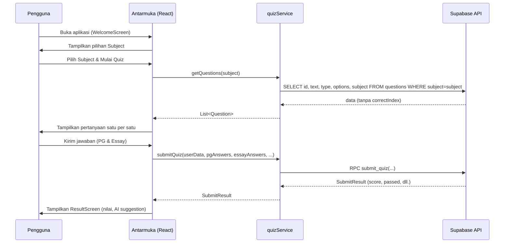
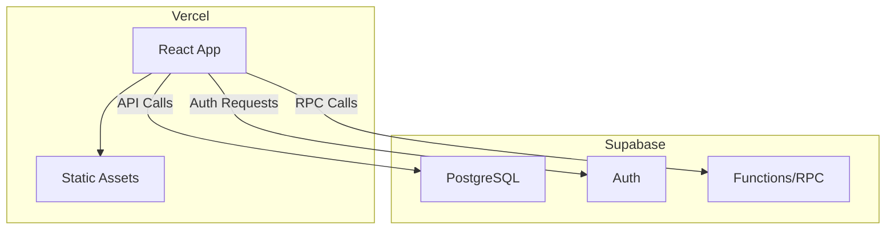
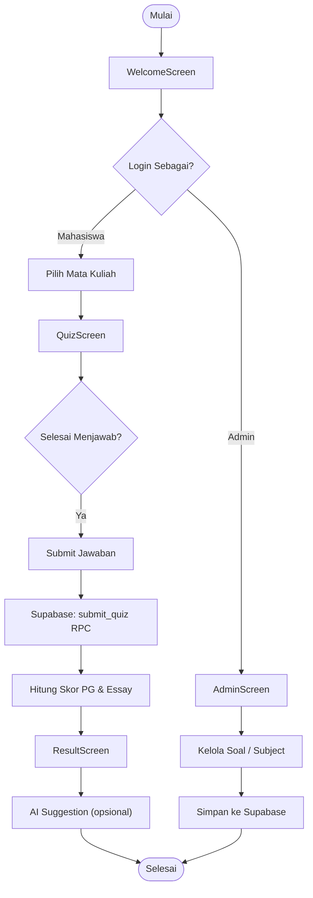
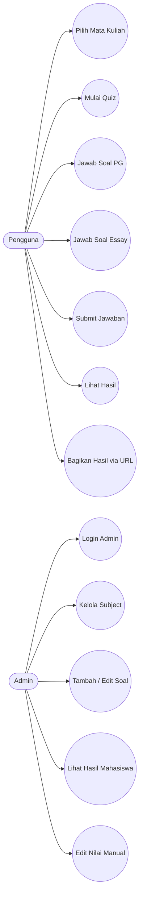

# Analisis Sistem & Dokumentasi UML (Bahasa Indonesia)

## 1. Gambaran Umum
Aplikasi **Quiz Remedial** adalah aplikasi web berbasis **React + Vite** dengan TypeScript. Front‑end berinteraksi dengan **Supabase** (PostgreSQL + Auth) melalui file utilitas `supabaseClient.ts`. 

- **Komponen utama**: `WelcomeScreen`, `AdminScreen`, `QuizScreen`, `ResultScreen`, dll.
- **Layanan (services)**: `quizService`, `subjectService`, `studentService`, `groqService` (AI). 
- **Tipe data** didefinisikan di `src/types.ts`.
- **Deploy**: Vercel (frontend) + Supabase (backend).

## 2. Diagram Komponen (Component Diagram)

## 3. Diagram Kelas / Tipe (Class Diagram) – berdasar `src/types.ts`

## 4. Diagram Urutan (Sequence Diagram) – Alur Quiz

## 5. Layanan (Services) dan Interaksi Supabase
| Service | Fungsi Utama | Metode Supabase yang Dipanggil |
|--------|--------------|--------------------------------|
| `quizService` | Ambil pertanyaan, submit jawaban, dapatkan hasil | `select`, `rpc('submit_quiz')`, `rpc('update_ai_suggestion')`, `select('quiz_results')` |
| `subjectService` | CRUD subject | `.from('subjects')` (select, insert, update, delete) |
| `studentService` | CRUD mahasiswa | `.from('students')` |
| `groqService` | AI generation (menggunakan Groq API, bukan Supabase) | - |

## 6. Alur Data (Data Flow) 
1. **Inisialisasi**: `supabaseClient.ts` membuat singleton `supabase` menggunakan env `VITE_SUPABASE_URL` & `VITE_SUPABASE_ANON_KEY`.
2. **Pengambilan Data**: Komponen (`QuizScreen`) memanggil `quizService.getQuestions()`, yang mengeksekusi query Supabase dan mengembalikan pertanyaan tanpa `correctIndex`.
3. **Pengiriman Jawaban**: Pada submit, `quizService.submitQuiz()` memanggil RPC `submit_quiz` yang menghitung skor PG & Essay di database dan mengembalikan `SubmitResult`.
4. **Penyimpanan AI Suggestion**: Setelah AI menghasilkan saran, `quizService.updateAiSuggestion()` memanggil RPC `update_ai_suggestion` untuk menyimpan ke tabel `quiz_results`.
5. **Pengambilan Hasil**: `ResultScreen` memanggil `quizService.getResultById(id)` untuk menampilkan detail hasil yang dapat dibagikan lewat URL.

## 7. Diagram Deployment (opsional)

---
**Catatan**: Diagram di atas menggunakan **Mermaid** sehingga dapat dirender secara langsung di platform yang mendukung markdown. Jika Anda memerlukan gambar PNG, beri tahu saya untuk mengekspor diagram.

---

## 8. Diagram Flowmap (High‑level Process Flow)

## 9. Diagram Use Case

---
*Dokumen ini dibuat untuk menjadi acuan pengembangan selanjutnya, sehingga tim tidak perlu melakukan pemindaian ulang kode sumber.*
